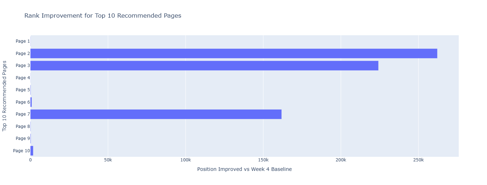

# Prioritizing Content Pages for CTR Review Using Search Performance Signals

- **Author:** Engy Elgamal
- **Lane:** CTR / Engagement Opportunity Scoring
- **Repo:** https://github.com/engyelgamal18/flyrank-ml-internship-engy
- **Date:** September 2026

## 1. Abstract

This project examines how search performance signals can be used to prioritize content pages for CTR review. I used March 2026 search performance data and evaluated the ranking on a validation period from March 25 to March 31. I created a priority ranking using impressions, CTR, and average search position and compared it with the Week 4 baseline on the same validation period. The analysis showed substantial differences in page priority between the two methods, with some pages moving much higher in the new ranking. The resulting ranking is intended as a directional decision-support tool to help editors decide which pages to review first.

## 2. Introduction / Problem

The goal of this project is to identify content pages that may be worth reviewing for possible CTR improvement. The unit of analysis is a content page, and the final output is a priority ranking that can help an editor decide which pages to review first.

Prioritization matters because editors may have many pages to evaluate but limited time for manual review. A ranking based on search performance signals provides a consistent way to surface potential review opportunities. However, the ranking is intended to support human judgment rather than determine automatically whether a page should be changed.

## 3. Data

The analysis uses March 2026 search performance data. The main signals used in the analysis are impressions, clicks, CTR, and average search position.

For the time-aware analysis, March 1–24 represents the earlier period and March 25–31 is used as the validation period. The Week 4 baseline and the new ranking are compared using the same validation period.

To keep the analysis public-safe, I did not use client names, URLs, private search queries, or other identifying information. Content IDs were used only to identify pages and were not used as predictive features. Fields such as `trend_direction` and `trend_pct` were excluded to reduce the risk of leakage.

## 4. Methodology

The analysis uses a ranking approach because the objective is to prioritize pages for review rather than make an automatic yes-or-no decision.

The new priority ranking combines three search performance signals: impressions, CTR, and average search position. The intention is to surface pages that have meaningful search visibility but may be under-capturing clicks or appearing in weaker search positions.

The Week 4 baseline ranks pages using impressions and the gap between expected CTR and actual CTR. Pages with more impressions and lower-than-expected CTR receive a higher baseline priority score.

A time-aware validation design was used rather than relying only on a random split. March 1–24 represents the earlier period, while March 25–31 is the validation period. The baseline and the new ranking are evaluated on the same validation window so that their rankings can be compared consistently.

Potential leakage fields were reviewed and excluded from the ranking inputs. In particular, fields such as `trend_direction` and `trend_pct` were not used. Client information, private queries, and content identifiers were also excluded as ranking features.

## 5. Results

The Week 4 baseline and the new ranking were compared on the same validation period: March 25–31, 2026.

The two methods produced substantially different priorities for some pages. For example, one page moved from baseline rank 136 to new rank 1. Another moved from baseline rank 300 to new rank 9. Some pages with a baseline score of zero also appeared near the top of the new ranking.

These differences show that the two ranking approaches surface different candidates for review. They do not establish that the new ranking is universally better than the baseline.

### Rank movement among the top recommendations



*Figure 1. Rank improvement for the top 10 recommended pages compared with the Week 4 baseline.*

The comparison of baseline and new ranks shows that several pages moved substantially higher under the new ranking. The size of the changes also varies considerably across pages, indicating that the new combination of search signals prioritizes some review candidates very differently from the baseline.

These results are directional and should be interpreted as evidence for prioritization and human review, not as evidence that changing the surfaced pages will improve CTR.

## 6. Limitations & Honest Framing

This analysis has several limitations. The priority ranking is based only on search performance signals such as impressions, CTR, and average search position. It does not directly measure content quality, conversions, business value, or the reason a page has a particular CTR.

A high priority score therefore does not prove that a page should be changed or that changing it will improve CTR. The observed differences between the baseline and new ranking also do not prove that the new ranking is always better.

The analysis is limited to March 2026 data, so page performance and ranking priorities may change as newer data becomes available. The results should therefore be treated as directional decision support and reviewed by a person before any content action is taken.

## 7. Ranked Recommendations

The highest-ranked pages should be reviewed first because the ranking identifies pages with combinations of meaningful impressions, low CTR, and weaker average search position.

Editors can use these signals as reason codes for review. Low CTR can prompt a review of titles and snippets, while weaker search position can prompt a broader review of content and search performance.

Pages that moved substantially higher in the new ranking than in the Week 4 baseline may also be useful candidates for additional review because the two methods prioritize them differently.

The ranking determines review priority, not whether a page should automatically be changed. All recommended actions require human review.

Because search performance can change over time, the ranking should be refreshed when newer data becomes available or when CTR, impressions, search position, or ranking stability changes meaningfully.

## 8. Reproducibility

The full project is available in the public GitHub repository:

https://github.com/engyelgamal18/flyrank-ml-internship-engy

The main capstone notebook is available at:

`work/notebooks/capstone.ipynb`

Supporting assignment notebooks are available in:

`work/notebooks/`

To reproduce the environment:

```bash
git clone https://github.com/engyelgamal18/flyrank-ml-internship-engy.git
cd flyrank-ml-internship-engy
pip install -r requirements.txt
```

The FlyRank dataset requires a Hugging Face read token stored as `HF_TOKEN`.

This project uses a ranking analysis rather than a randomly initialized model, so a random seed is not required for the ranking calculation. The analysis uses a time-aware validation period and does not claim evaluation on a sealed holdout test.

## 9. Acknowledgments & Data Credit

Built on the [FlyRank ML Internship dataset](https://flyrank.ai/).
